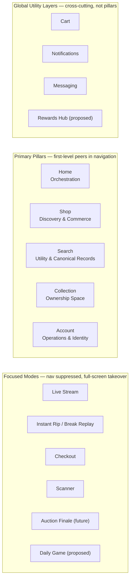
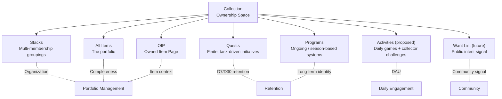
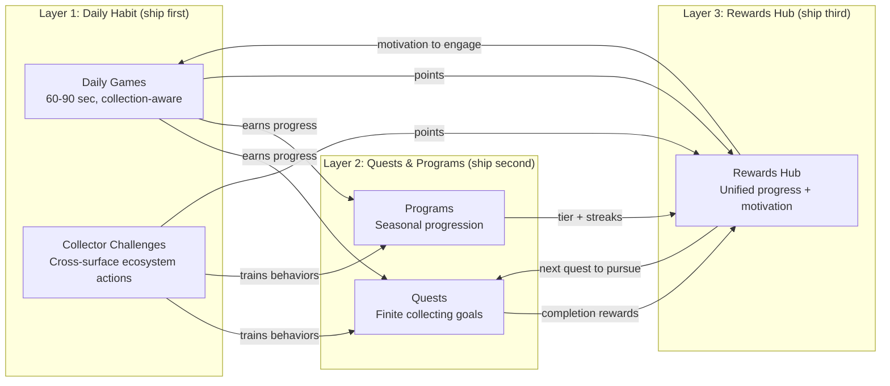
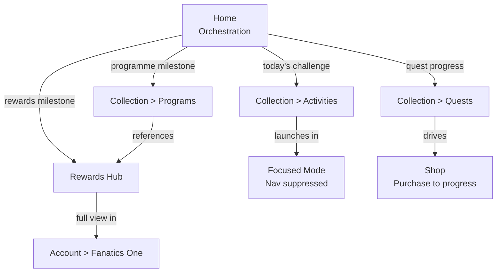

# Fanatics Collect — App Architecture Schematic

**Purpose:** Communicate the Collect app architecture clearly to leadership and cross-functional stakeholders.
**Sources:** [Structural Model (Notion)](https://www.notion.so/fanaticscollect/Fanatics-Collect-Structural-Model-30bd7c400ecf805c8914e8c2150740df) · [Proposed Changes](structural-model-proposed-changes.md) · [Strategy Brief](games-quests-programmes-strategy-brief.md)

---

## North Star

Fanatics Collect is evolving from **a commerce app with ownership attached** to **an ownership-first collecting platform with industry-best commerce embedded.** The product should increasingly answer: *"What's happening in my collecting world?"*

Ownership is the center of gravity. Commerce, operations, and social activity orbit around it.

---

## View 1: Product Architecture

*"How is the app structured?"*

Three layers define the architecture: **pillars** (primary navigation), **global utilities** (cross-cutting, accessible from anywhere), and **focused modes** (immersive experiences that take over the screen).

### What each pillar owns

| Pillar | Job | Must not become |
|---|---|---|
| **Home** | Curate what matters right now. Reference other surfaces, never replace them. | A utility dump or a clone of other pillars |
| **Shop** | Discovery and commerce. Discover (curated browsing) + Saved (private discovery memory). | Account machinery |
| **Search** | Intent-driven finding. Blended results: listings, entity hubs, canonical records. | A merchandised storefront (that's Shop) |
| **Collection** | Organize, display, and manage what I own. Portfolio-first. Houses Quests, Programs, Activities, Stacks, OIP. | A workflow log or submission tracker |
| **Account** | System machinery: Orders, Selling, Vault Activity, Wallet, Preferences, Help, Fanatics One. | A discovery surface or social feed |

### What each global utility does

| Utility | Job | Access pattern |
|---|---|---|
| **Cart** | Persistent commerce container across sessions and devices. | Visible in commerce-intent surfaces; toast + "View cart" from non-commerce surfaces |
| **Notifications** | System-to-user communication channel. Payments, state changes, platform events. | Global layer (not a tab). Cleared when resolved, not when read. |
| **Messaging** | User-to-user relationship space. Conversations, offers, trade negotiation. | Global entry point (header). Full-screen destination. |
| **Rewards Hub** (proposed) | Cross-ecosystem progress and motivation. Points, tiers, streaks, earning opportunities. | Quick check (header icon overlay) + Full view (Account > Fanatics One) |

### Rewards Hub vs Wallet — the distinction

- **Collection** shows what you did — *"Quest: Rip 3 Series 1 packs — 2/3 complete"*
- **Rewards Hub** shows what you earned — *"150 points this week, 50 to next tier"*
- **Wallet** shows what you hold — *"FanCash balance: $12.50"*

---

## View 2: Collection Detail — Ownership Gravity

*"What lives inside Collection and why?"*

Collection is the ownership space. Everything inside it reinforces why ownership matters — making collecting active rather than passive.

### How Programs, Quests, and Activities relate

All three reinforce ownership gravity. They are distinct but connected:

| Type | Duration | Purpose | Examples |
|---|---|---|---|
| **Activities** | Daily / weekly, repeatable | Build daily habit, train ecosystem behavior | Trivia, stat-or-bluff, "rip a pack," "scan a card" |
| **Quests** | Finite, multi-day | Reward collecting behavior, drive retention | Set quests, player quests, chase quests |
| **Programs** | Ongoing / seasonal, no endpoint | Create persistent identity and progress | FanCash Trading Card, Performance Cards, Red Rookie, streak tiers |

Activities are collection-aware — what a collector owns shapes what they see. Completion feeds into quest and programme progress, creating a chain from daily habit to long-term identity.

---

## View 3: Engagement Ecosystem — How It Connects

*"How do games, quests, programs, and rewards compound into a flywheel?"*

Each layer creates the conditions for the next. All write to shared progress infrastructure from day one.

### Where each layer surfaces in the app

Home orchestrates by surfacing the right entry point at the right time. It references these surfaces — it never replaces them.

### How this maps to goals

| Goal | Layer 1: Daily Activities | Layer 2: Quests & Programs | Layer 3: Rewards Hub |
|---|---|---|---|
| **DAU** | Primary driver — daily reason to open | Reinforces — "check quest progress" | Compounds — "see everything, earn everywhere" |
| **D7 retention** | Streak mechanics create 7-day hooks | Multi-day quests are the main D7 lever | Visualizes streak/progress, triggers loss aversion |
| **D30 retention** | Streaks alone fade past ~14 days | Rotating programmes and seasonal events | Long-term identity and tier progression |
| **Collecting behavior** | Indirect — builds habit and affinity | Direct — quests require rips, purchases, scans | Connecting layer — "here's what to do next" |
| **GMV** | Session frequency correlates to spend | Quests drive purchasing as gameplay | Rewards redemption creates reinvestment loops |

---

## Quick Reference

### Architecture at a glance

| Layer | Elements | Key principle |
|---|---|---|
| **Global Utilities** | Cart, Notifications, Messaging, Rewards Hub (proposed) | Cross-cutting. Not pillars. Accessible from anywhere. |
| **Primary Pillars** | Home, Shop, Search, Collection, Account | First-level peers. Each has a clear job. No hierarchy. |
| **Focused Modes** | Live stream, Instant rip, Checkout, Scanner, Auction finale, Daily game (proposed) | Nav suppressed. Full-screen takeover. Additive, not new pillars. |

### Structural guardrails

- **Home orchestrates, it does not replace.** Home surfaces and deep links. It never absorbs functionality from other pillars.
- **Collection is ownership gravity.** Quests, programs, activities, stacks — all reinforce why ownership matters.
- **Account is machinery.** Orders, selling, vault, wallet. Not discovery, not social.
- **Rewards are not a pillar.** Rewards are cross-cutting. The Rewards Hub is a global utility layer, not a navigation tab.
- **Hide nav only for mode changes.** Depth alone does not justify suppressing navigation.
- **Mode-based experiences are additive.** New immersive experiences (daily games, auction finale) enter focused mode — they do not require new pillars.
