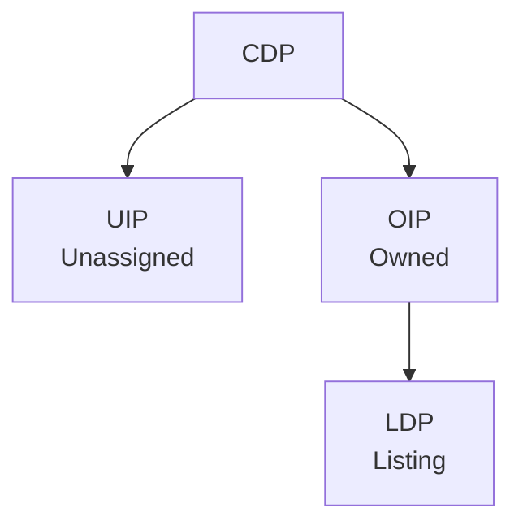

# Detail Page Taxonomy

| Field | Value |
|-------|-------|
| **Category** | Taxonomy |
| **Subdomain** | Marketplace / Collect / Live |
| **Title** | Detail Page Taxonomy |
| **Version** | 1.0 |
| **Date** | 2025-10-06 |
| **Maintainer** | Product, Fanatics Collect |
| **Status** | Active |

---

This taxonomy defines the types of **Detail Pages** across Collect, Live, and Seller OS. A Detail Page is the primary page where a product, card, or listing is represented and acted on. The goal is to provide a **shared language** and consistent framework for categorising any product, collectible, or listing into the correct page type.

---

## Page Types

- **PDP (Product Detail Page)**
  - For **standardized, platform/brand-controlled products or product experiences**.
  - Buyers purchase fungible units or slots (every unit/slot is equivalent).
  - Examples: Topps Drops, sealed wax SKUs, Instant Rips.
  - Custody: may exit custody if shipped; may become OIP → LDP if vaulted.

- **CDP (Catalog Detail Page)**
  - The **evergreen record** of a card as a concept (set, year, number, parallels).
  - Exists regardless of ownership or listings.
  - Anchors all collectible instances.
  - Example: 1999 Pokémon Bubble Mew #X.

- **UIP (Unassigned Item Page)**
  - A **cert-backed unique instance** in the system without an owner.
  - Primarily for graded items (unique cert numbers).
  - Converts to OIP when claimed; can spawn LDP if listed.
  - Example: PSA 10 Jordan Rookie, cert #123456, unclaimed.

- **OIP (Owned Item Page)**
  - A **private record of an owned instance**, with optional public showcase view.
  - Owner's control surface: list, vault, transfer, withdraw.
  - If listed, shows status + link to LDP.
  - Example: A user's PSA 9 Charizard in vault.

- **LDP (Listing Detail Page)**
  - **Buyer-facing, transactional page** for a specific seller listing.
  - Always instance-framed (a unique item from a seller).
  - Transaction modules: Auction, Buy Now, Offers, Breaks, Repacks.
  - Created from OIP (typical) or directly from CDP/UIP (e.g. dropshippers).
  - Examples: Vaulted PSA 10 listing, Breaks, Seller Repacks, Dropshipper inventory.

---

## Discriminator Logic

- **PDP = standardized offer**
  - Units/slots fungible.
  - Platform/brand-controlled.
  - Examples: Topps Drops, Instant Rips.

- **LDP = specific listing**
  - Instance-framed, seller-controlled.
  - Examples: Vaulted listings, Breaks, Repacks, Dropshipper stock.

- **CDP/UIP/OIP = lifecycle anchors** for collectibles.

**Key clarifications:**
- "Mystery" or "unknown" content ≠ automatically PDP.
  - Repacks are LDPs (seller-owned).
  - Instant Rips are PDPs (platform-curated).
- Vault custody ≠ automatically PDP.
  - Vaulted listings are still LDPs if seller-owned.

---

## Custody States

(Affect OIP, LDP, and CDP aggregations.)

- **Vaulted** → verified, instant transfer, insured (includes Instant Rips, vaulted Topps).
- **Self-owned** → seller custody, requires shipping/authentication (includes Breaks, Repacks).
- **In transit** → to vault, buyer, or grader; restricted actions.
- **At grader** → grading in progress; listing disabled or delayed.
- **Shipped retail (exit)** → PDPs delivered directly to buyer leave Collect custody.

---

## Lifecycle

- **CDP** (card concept)
  → **UIP** (cert instance, unassigned)
  → **OIP** (owned instance)
  → **LDP** (listed instance).

- **PDP** = parallel root for retail/gamified products.
  - If vaulted → may enter OIP → LDP lifecycle.
  - If shipped → leaves custody.

---

## Live Experience Mapping

- **Instant Rips** → PDP subtype.
  - Standardized slots, platform-controlled, vaulted supply.
  - Ephemeral PDP, retired after the show.
  - Cards transfer to OIPs.

- **Breaks & Personals** → LDP subtype.
  - Seller-owned sealed products, self-custody.
  - Buyers purchase slots (Breaks) or the full box (Personals).
  - Fulfillment outside Collect.

- **Seller Repacks** → LDP subtype.
  - Seller-created mystery packs.
  - Instance-framed, seller-controlled.

- **Dropshippers** → LDPs.
  - Listings created directly from CDP, without OIP.

---

## Principle for Future Classification

When a new product type or mechanic emerges, classify it by:

1. **Offer framing:**
   - Standardized SKU/experience → PDP.
   - Specific seller-owned listing → LDP.

2. **Lifecycle position:**
   - Concept → CDP.
   - Unassigned instance → UIP.
   - Owned instance → OIP.
   - Listed instance → LDP.

3. **Custody state:**
   - Vaulted, Self-owned, In transit, At grader, or Shipped retail → determines fulfillment rules, but not page type.

---

## Navigation and Access Patterns

- OIP access: Collection view only
- LDP access: Marketplace tab + from OIP (if for sale)
- CDP access: Add card search, scanner, potentially unified search in future
- Future breadcrumb navigation: OIP/LDP could link back up to CDP
- Technical mapping between vault items and catalog items still needs resolution

---

## Link between pages

A UIP can become an OIP when a user proves the ownership of the item.
